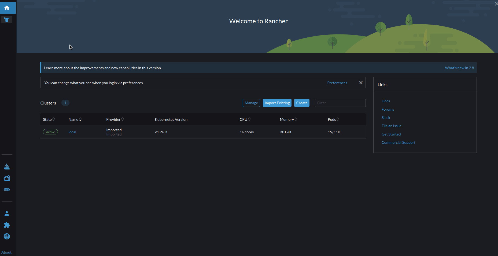

# Via Rancher Dashboard

This is the recommended option for installing Rancher Turtles. 

Via Rancher UI, and just by adding the Turtles repository, we can easily let Rancher take care of the installation and configuration of the Cluster API Extension.

:::caution
If you already have Cluster API Operator installed in your cluster, you should use the [manual helm install method](./using_helm.md) instead.
:::

:::info
Before [installing Rancher Turtles](./using_helm.md#install-rancher-turtles-with-cluster-api-operator-as-a-helm-dependency) in your Rancher environment, Rancher's `embedded-cluster-api` functionality must be disabled. This includes also cleaning up Rancher-specific webhooks that otherwise would conflict with CAPI ones.

To simplify setting up Rancher for installing Rancher Turtles, the official Rancher Turtles Helm chart includes a `pre-install` hook that applies these changes, making it transparent to the end user:
- Disable the `embedded-cluster-api` feature in Rancher.
- Delete the `mutating-webhook-configuration` and `validating-webhook-configuration` webhooks that are no longer needed.
:::

If you would like to understand how Rancher Turtles works and what the architecture looks like, you can refer to the [Architecture](../../reference-guides/architecture/intro.md) section.

:::note
If uninstalling, you can refer to [Uninstalling Rancher Turtles](../uninstall_turtles.md)
:::

### Installation

- From your browser, access Rancher Manager and explore the **local** cluster.
- Using the left navigation panel, go to `Apps` -> `Repositories`.
- Click `Create` to add a new repository.
- Enter the following:
    - **Name**: `turtles`.
    - **Index URL**: https://rancher.github.io/turtles.
- Wait for the `turtles` repository to have a status of `Active`.
- Go to `Apps` -> `Charts`.
- Filter for `turtles`.
- Click `Rancher Turtles - the Cluster API Extension`
- Click `Install` -> `Next` -> `Install`.

:::caution
Rancher will select not to install Turtles into a [Project](https://ranchermanager.docs.rancher.com/how-to-guides/new-user-guides/manage-clusters/projects-and-namespaces) by default. Installing Turtles into a Project is not supported and the default configuration `None` should be used to avoid unexpected behavior during installation.
:::

This will use the default values for the Helm chart, which are good for most installations. If your configuration requires overriding some of these defaults, you can either specify the values during installation from Rancher UI or, alternatively, you can opt for the [manual installation via Helm](./using_helm.md). And, if you are interested on learning more about the available values, you can check the [reference guide](../../reference-guides/rancher-turtles-chart/values.md).

The installation may take a few minutes and, when it finishes, you will be able to see the following new deployments in the cluster:
- `rancher-turtles-system/rancher-turtles-controller-manager`
- `rancher-turtles-system/rancher-turtles-cluster-api-operator`
- `capi-system/capi-controller-manager`

